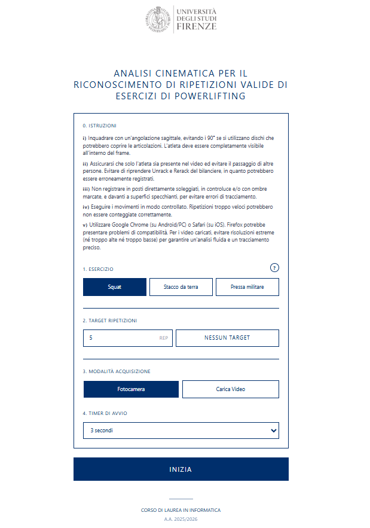

# Powerlifting & Computer Vision

Applicazione web per l'analisi cinematica nel browser e il riconoscimento automatico delle ripetizioni di squat, stacco da terra e pressa militare.
I frame vengono elaborati localmente con MediaPipe Pose Landmarker e non sono inviati a server esterni.



## Funzionalità

- Acquisizione da fotocamera anteriore o posteriore.
- Analisi di video MP4, WebM e QuickTime caricati dall'utente.
- Conteggio separato delle ripetizioni valide e non valide.
- Overlay su canvas con scheletro, angolo articolare e feedback immediato.
- Registrazione ed esportazione dell'analisi con riepilogo della sessione.
- Elaborazione multi-persona con continuità del soggetto selezionato.

## Architettura

- `src/App.jsx`: interfaccia e flusso di acquisizione.
- `src/hooks/usePose.js`: lifecycle MediaPipe, fotocamera e ciclo di inferenza.
- `src/logic/repLogic.js`: macchine a stati e validazione degli esercizi.
- `src/config/exercises.js`: soglie biomeccaniche e configurazione del motore.
- `src/utils/canvasRenderer.js`: rendering dell'overlay e dell'HUD.
- `src/hooks/useVideoRecorder.js`: registrazione ed esportazione del canvas.

## Avvio locale

Richiede una versione recente di [Node.js](https://nodejs.org/).

```bash
git clone https://github.com/Persheshow/appMediaPipe.git
cd appMediaPipe
npm install
npm run dev
```

Vite mostra nel terminale l'indirizzo locale da aprire nel browser. Per usare la fotocamera fuori da `localhost` è necessario servire l'applicazione tramite HTTPS.

## Verifica

```bash
npm test
npm run lint
npm run build
```

La verifica completa deve inoltre riprodurre fino alla fine i video inclusi in
`public/assets` e confrontare il numero di ripetizioni valide con questa
baseline:

| Esercizio | Video | Valide | No-rep |
| --- | --- | ---: | ---: |
| Squat | `SquatDemo.mp4` | 3 | 0 |
| Stacco da terra | `DeadliftDemo.mp4` | 3 | 0 |
| Pressa militare | `OverheadPressDemo.mp4` | 4 | 0 |

Una modifica non è considerata verificata se uno dei conteggi cambia.

## Utilizzo

1. Selezionare esercizio, target e modalità di acquisizione.
2. Inquadrare tutto il corpo con una vista prevalentemente sagittale.
3. Avviare l'analisi e mantenere visibili le articolazioni richieste.
4. Al termine, scaricare oppure ignorare la registrazione prodotta.

Durante la sessione il punto articolare è rosso mentre il target geometrico non è raggiunto e verde quando lo è..

## Contesto accademico

Progetto sviluppato per la tesi del Corso di Laurea in Informatica dell'Università degli Studi di Firenze, A.A. 2025/2026.
